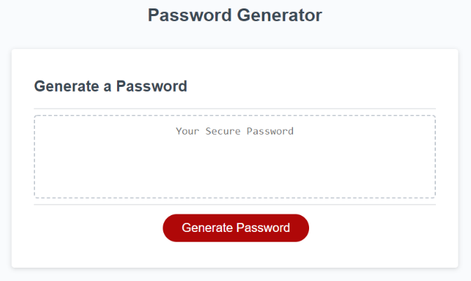

# password-generator

## Description

Applying my recent learning, I have utilised JavaScript code to create an application that an employee can use to generate a random password based on criteria they've selected. 

The app operates in the browser and presents the user with a series of prompts to determine the type and amount of characters the user requires for their random password.
 

## Screen Shot
The following images show the web application's appearance and functionality:

##Link to deployed application

## License
Please refer to the LICENSE in the repo.
